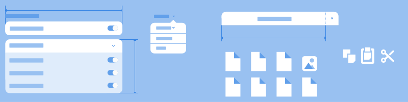

Containers
==========

Containers are some of the main UI building blocks. They include the primary containers for other UI elements, like :doc:`windows </containers/windows>` and :doc:`header bars </containers/header-bars>`. They also include some of the main layout frameworks, in the shape of :doc:`lists </containers/lists>` and :doc:`flow boxes </containers/flow-boxes>`.

Contents
--------

.. toctree::
   :maxdepth: 1

   containers/windows
   containers/header-bars
   containers/popovers
   containers/utility-panes
   containers/lists
   containers/flow-boxes
   containers/model-based