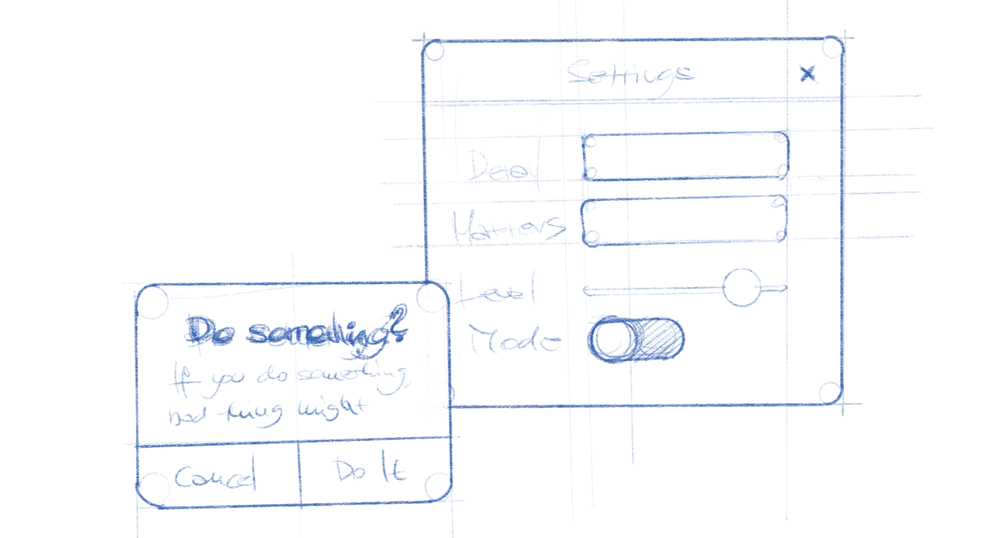

Dialogs
=======

Dialogs are windows that appear over, and are bound to, a parent window. They are a basic way to show information and controls. There are three types of dialog in GNOME:

* **Message dialogs**: a special type of dialog which is primarily used for feedback, which is :doc:`covered elsewhere </feedback/message-dialogs>`.
* **Action dialogs**: present options and/or information about a specific action, before it is carried out. Print dialogs are a classic example of action dialogs.
* **Presentation dialogs**: contain information or controls, such as properties.

GNOME also provides a number of predefined dialogs for common situations, including preferences and about dialogs.

General guidelines
------------------

* Dialog windows should never pop up unexpectedly, and should only ever be displayed in immediate response to a deliberate user action.
* Dialogs should always have a parent window.
* Avoid stacking dialog windows on top of one another. Ideally, only one dialog window should be displayed at a single time.
* When opening a dialog, provide initial keyboard focus to the component that you expect users to operate first. This focus is especially important for users who must use a keyboard to navigate.

Dialogs obscure other content and require a context switch on the part of a user. As a result, in many situations, more discrete or inline disclosure is preferred. This can include:

* Using inline composition for new messages, records or contacts.
* Using :doc:`menus </controls/menus>` or :doc:`popovers <popovers>` to display additional controls or options in a less disruptive manner.
* Restricting preferences to a small number of controls, which are placed in a menu.

Action Dialogs
--------------

Action dialogs have a header bar, a heading which describes the action, and two primary buttons — one which carries out the action and one which cancels it.

* Label the affirmative button with a specific imperative verb, for example: *Save* or *Print*. This is clearer than a generic label like *OK* or *Done*.
* Always ensure that the cancel button appears first, before the affirmative button. In left-to-right locales, this is on the left.
* Sometimes, the user may be required to choose options before an action can be carried out. In these cases, the affirmative dialog button should be insensitive until the required options have been selected.
* Ensure that the escape key activates the cancel button.

Presentation Dialogs
--------------------

Presentation dialogs present information or controls. Like action dialogs, they have a header bar and a subject.

Presentation dialogs should generally be instant rather than explicit apply. :doc:`View switchers </nav/view-switchers>` can be used to break up controls and information.
  
Pre-defined dialogs
-------------------

GNOME provides pre-defined dialogs for several common use cases.

Preferences Windows
~~~~~~~~~~~~~~~~~~~

`HdyPreferencesWindow <https://gnome.pages.gitlab.gnome.org/libhandy/doc/1-latest/HdyPreferencesWindow.html>`_

While preferences windows are a common design pattern, it is often better not to have, if that is possible. Always question whether additional settings are really necessary, and make an effort to ensure that your application design works for everybody without the need to change its settings.

About Dialogs
~~~~~~~~~~~~~

`GtkAboutDialog <https://developer.gnome.org/gtk3/stable/GtkAboutDialog.html>`_

API reference
-------------

* `GtkDialog <https://developer.gnome.org/gtk3/stable/GtkDialog.html>`_