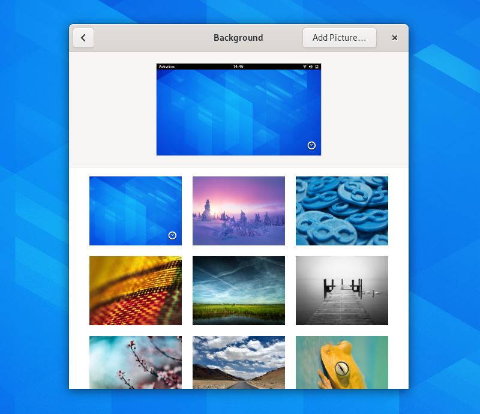

Grid Views
==========

Grid views present a grid of images, which typically represent content items. Examples of grid view usage include a document browser, with a grid of document thumbnails that can be opened, or a background chooser, with a grid of images from which the user can select.

Guidelines
----------

* Wherever possible, each grid item should have a unique thumbnail.
* Order the items in the grid according to what will be most useful to users. Ordering content according to most recently added is often the best arrangement.
* The visual styling of the grid should be appropriate to the type of content being displayed. In general, the goal should be to minimize visual distractions and allow the content itself to shine. However, in cases where grid images have irregular shapes or inconsistent appearance, it may be necessary to outline each grid cell.
* Grids views and :doc:`list views <list-column-views>` can be used in conjunction to offer different views of the same content collection. Here, the list view can be useful for displaying additional metadata for each content item, such as creation dates or authorship.
* Most grids will be contained within resizable windows, and should therefore be tested to ensure they look good at the range of :doc:`expected window sizes and screen resolutions </guidelines/adaptive>`. Often, flow boxes should be given a maximum width, in order to prevent uncomfortably long rows or the grid reflowing to a small number of rows.

API Reference
-------------

* `GTK 4: GtkGridView <https://gnome.pages.gitlab.gnome.org/gtk/gtk4/class.GridView.html>`_