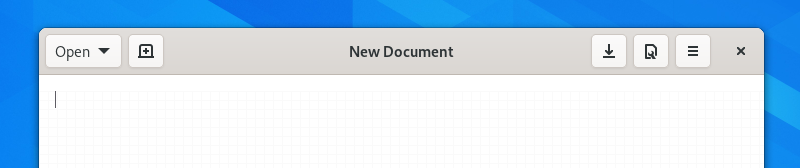

Header Bars
===========

Header bars are a standard element that spans the top of windows. They allow the window to be dragged, are the site for window management features, and contain application controls.

Header bars often include:

* :doc:`Buttons </controls/buttons>` for the main user actions, such as *new*, *add*, *open* and *back*, which are placed at the start of the header bar.
* A window heading, which is placed in the center (sometimes this is replaced with a :doc:`view switcher </nav/view-switchers>`.)
* :doc:`Menus </controls/menus>`, which are typically placed at the end.

Guidelines
----------

* As described above, arrange controls within the header bar according to the three alignment points — left, center and right.
* Header bars should only contain a small number of key controls — this will help users to understand the primary functionality provided by the window, and will ensure that the window can be resized to narrow widths. Additional controls can be included elsewhere.
* The content of header bars can — and should — update along with view or mode changes. This ensures that header bar controls are always relevant to the current context:
   * If the window includes multiple views (see :doc:`navigation </guidelines/navigation>`), the header bar can show different controls for each view.
   * If the window incorporates navigation, different controls can be shown depending on the location displayed in the window.
* Always ensure that there is some blank space in the header bar to allow it to be dragged. This is necessary to allow windows to be moved.
* Primary window header bar controls should all have :doc:`tooltips </feedback/tooltips>`.

API Reference
-------------
* `Adwaita: AdwHeaderBar <https://gnome.pages.gitlab.gnome.org/libadwaita/doc/main/class.HeaderBar.html>`_
* `Handy: HdyHeaderBar <https://gnome.pages.gitlab.gnome.org/libhandy/doc/1-latest/HdyHeaderBar.html>`_
* `GTK 4: GtkHeaderBar <https://gnome.pages.gitlab.gnome.org/gtk/gtk4/class.HeaderBar.html>`_
* `GTK 3: GtkHeaderBar <https://developer.gnome.org/gtk3/stable/GtkHeaderBar.html>`_
