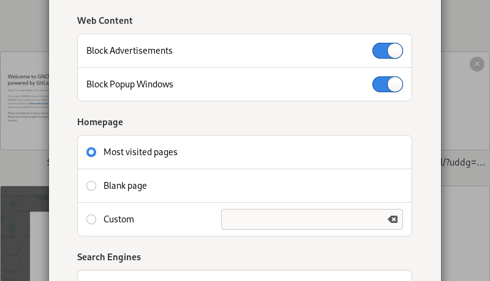

Lists
=====

Lists are often used to organize sets of controls as well as content. Examples include application preferences, a contacts list, or a list of recent documents.

The standard list in GNOME is appropriate for relatively small static lists. For larger lists, see :ref:`list views <list-views>`.

Guidelines
----------

* If a list is long, make it possible to search it using the standard :doc:`search design pattern </nav/search>`.
* Rows typically contain between one and three elements. Different text elements can be differentiated using :doc:`text size, weight and color </guidelines/typography>`.
* If icons are included in a list, they should use the :doc:`symbolic style </guidelines/ui-icons>`. The lower visual footprint of these icons will mean that they do not visually overload or dominate your list.
* Rows which expand or open another view when activated should have a ``go-next-symbolic`` arrow placed at the end.
* Lists should have a minimum and maximum width, in order to support :doc:`adaptive scaling </guidelines/adaptive>`.

When a list contains controls:

* Follow the example lists for row layout. Typically, the row label should be placed at the start of the row, and controls at the end.
* While rows can contain multiple controls, they can become crowded quickly. Where possible, try and have only a single control in each list row, and don't include more than two.
* Activating a list row background (such as by clicking) should trigger its control.

Design conventions exist for editable lists, with rows that can be added and removed. Each row should contain a remove button. If the number of items is short, the final list row should be used as an add button.

API Reference
-------------

* `GTK 4: GtkListBox <hhttps://gnome.pages.gitlab.gnome.org/gtk/gtk4/class.ListBox.html>`_
* `Adwaita: AdwActionRow <https://gnome.pages.gitlab.gnome.org/libadwaita/doc/main/class.ActionRow.html>`_
* `Adwaita: AdwExpanderRow <https://gnome.pages.gitlab.gnome.org/libadwaita/doc/main/class.ExpanderRow.html>`_
* `GTK 3: GtkListBox <https://developer.gnome.org/gtk3/stable/GtkListBox.html>`_
* `Handy: HdyActionRow <https://gnome.pages.gitlab.gnome.org/libadwaita/doc/main/AdwExpanderRow.html>`_
* `Handy: HdyExpanderRow <https://gnome.pages.gitlab.gnome.org/libhandy/doc/1-latest/HdyActionRow.html>`_
* Use the ``.content`` style class to ensure proper spacing.
