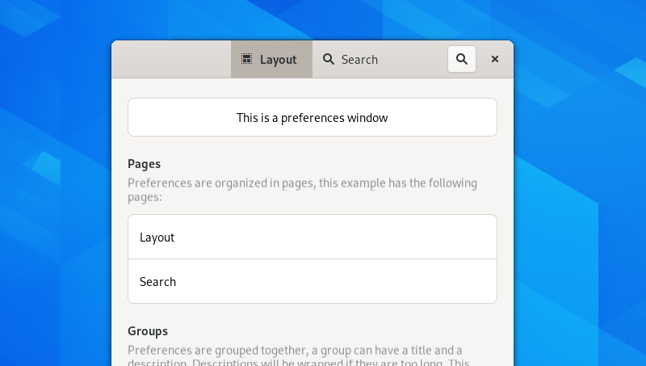

Preferences
===========

Most Apps have some configuration options, to control its behavior. To implement a preferences dialog, you should follow the conventions described here.

When to Use
-----------

Keep your app as easy to use as possible, so lesser options are generally better. If you have only very few preferences, you can position them in a submenu in the :ref:`primary menu <primary-menus>`, rather then in a full dialog window. For example a weather app could do this for switching between temperature units.

Layout
------

* A preferences window has a :doc:`viewswitcher </nav/view-switchers>` in its :doc:`headerbar </containers/header-bars>`, to divide the options into pages.
* Also on the right side is a search button. With him you can search through all options, not only in one section. When you click it, the search field appears in the headerbar, where the viewswitcher was before, not in a search bar. For more information, look at the :doc:`search </nav/search>` page.
* The content of a preferences window is typically a list. Every entry in the lists corresponds to one setting. The entries can be logically grouped together and can have subtitles.

All these properties are implemented by widgets from the handy and adwaita library. Just use them.

API Reference
-------------

* `Adwaita: HdyPreferencesWindow <https://gnome.pages.gitlab.gnome.org/libadwaita/doc/main/AdwPreferencesWindow.html>`_
* `Adwaita: HdyPreferencesRow <https://gnome.pages.gitlab.gnome.org/libadwaita/doc/main/AdwPreferencesRow.html>`_
* `Adwaita: HdyPreferencesPage <https://gnome.pages.gitlab.gnome.org/libadwaita/doc/main/AdwPreferencesPage.html>`_
* `Adwaita: HdyPreferencesGroup <https://gnome.pages.gitlab.gnome.org/libadwaita/doc/main/AdwPreferencesGroup.html>`_
* `Handy: HdyPreferencesWindow <https://gnome.pages.gitlab.gnome.org/libhandy/doc/1-latest/HdyPreferencesWindow.html>`_
* `Handy: HdyPreferencesRow <https://gnome.pages.gitlab.gnome.org/libhandy/doc/1-latest/HdyPreferencesRow.html>`_
* `Handy: HdyPreferencesPage <https://gnome.pages.gitlab.gnome.org/libhandy/doc/1-latest/HdyPreferencesPage.html>`_
* `Handy: HdyPreferencesGroup <https://gnome.pages.gitlab.gnome.org/libhandy/doc/1-latest/HdyHeaderGroup.html>`_
