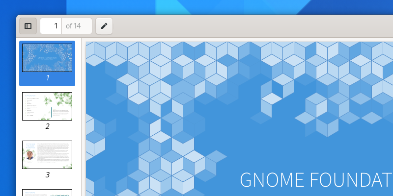

Utility Panes
=============

Utility panes are vertical panels which are shown on one side of a window. They have some similarities with :doc:`sidebars </nav/sidebars>`, but play a different role and have slightly different behavior.

When to Use
-----------

Use a utility pane to display additional controls, locations or information alongside the main window view. The content of the utility pane should be relevant to the main view, and can include things like a tools palette, browser history, spell checking results, or document metadata.

Guidelines
----------

* Utility panes can vary in whether they appear on the left or right side of the window. To determine this, follow the visual and functional hierarchy of the window: if the pane affects the main view, place it on the left; if it is subordinate to the main view, place it on the right.
* Utility panes can be permanent or transient. Transience can come from pane visiblity being toggled by the user, or from the pane only being visible when a particular feature is in use. In some cases, it might be desirable to include a toggle button in the header bar to control pane visibility.
* Unlike sidebars, utility panes should not intersect the header bar.
* To support :doc:`responsive scaling </guidelines/responsive>`, ensure that a utility pane will overlap the main view when there isn't available width to show it alongside. This can be acheived with a flap widget.
* If utility pane visibility can be toggled, assign the F9 key as a shortcut.

API Reference
-------------

* `Adwaita: AdwFlap <https://gnome.pages.gitlab.gnome.org/libadwaita/doc/main/AdwFlap.html>`_
* `Handy: HdyFlap <https://gnome.pages.gitlab.gnome.org/libhandy/doc/1-latest/HdyFlap.html>`_
