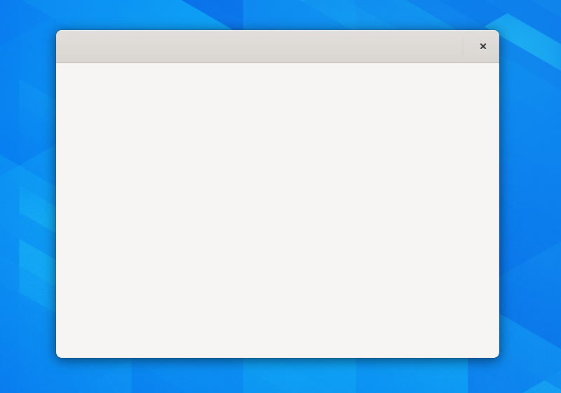

Windows
=======

Windows are the main containers for application user interfaces.

Primary Windows
---------------

Primary windows host the main functionality of your application, and are what is displayed when your application is launched.

* Primary windows should always be independent — closing one primary window should not result in other primary windows being closed.
* Apps can be single primary window only, or they can have multiple primary windows open at any one time. Multiple primary windows are common for viewer or editor apps.
* All primary windows should be resizable.
* The default size of primary windows should be appropriate to their content. Windows that display large content like documents or videos should be suitably large to provide a good experience without the need to resize the window. On the other hand, windows with a limited amount of UI can and should default to a smaller size.

Secondary Windows
-----------------

Secondary windows are used to contain supplemental controls or information, which are infrequently used. Standard secondary windows include **About Windows** and **Preferences Windows**.

* Secondary windows should always be dependent on a primary window, so that closing the primary also closes the secondary.
* Secondary windows can contain information and preferences that are relevant to the entire application, or they can contain information and options for a single content item, such as a document **Properties Window**.
* Typically, secondary windows are modal to a parent window. This ensures that windows are grouped together.
* In more unusual cases, secondary windows can be non-modal to their parent window. This is typically when they provide equivalent functionality to the primary window, such as an email app that allows individual emails to be popped out into their own windows.

General Guidelines
------------------

* Windows should follow the standard Ctrl+W keyboard shortcut to close. Additionally, modal windows should close on Esc.
* Applications which restore a particular view or content item when they are restarted should also restore their previous window size (but not position).

Additional guidance on window sizing can be found in the :doc:`scaling and responsiveness guidelines </guidelines/responsive>`.

API Reference
-------------

* `Adwaita: AdwApplicationWindow <https://gnome.pages.gitlab.gnome.org/libadwaita/doc/main/class.ApplicationWindow.html>`_
* `GTK 4: GtkApplicationWindow <https://gnome.pages.gitlab.gnome.org/gtk/gtk4/class.ApplicationWindow.html>`_
* `GTK 4: GtkAboutDialog <https://gnome.pages.gitlab.gnome.org/gtk/gtk4/class.AboutDialog.html>`_
* `Adwaita: AdwPreferencesWindow <https://gnome.pages.gitlab.gnome.org/libadwaita/doc/main/class.PreferencesWindow.html>`_
* `Handy: HdyApplicationWindow <https://gnome.pages.gitlab.gnome.org/libhandy/doc/1-latest/HdyApplicationWindow.html>`_
* `GTK 3: GtkApplicationWindow <https://developer.gnome.org/gtk3/stable/GtkApplicationWindow.html>`_
* `GTK 3: GtkAboutDialog <https://developer.gnome.org/gtk3/stable/GtkAboutDialog.html>`_
* `Handy: HdyPreferencesWindow <https://gnome.pages.gitlab.gnome.org/libhandy/doc/1-latest/HdyPreferencesWindow.html>`_
