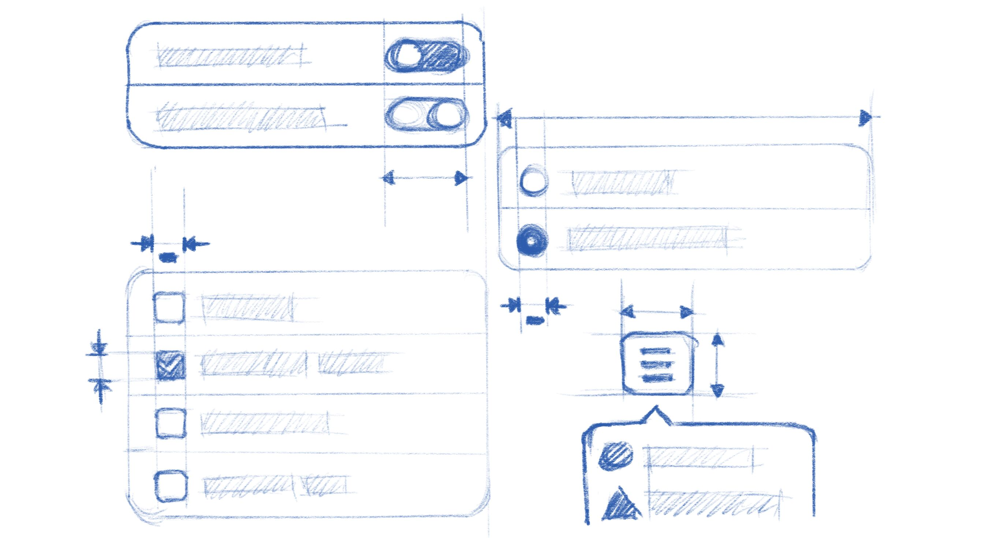

Controls
========

The basic interactive UI elements for apps, used for taking actions and selecting options.

Section Contents
----------------

.. toctree::
   :maxdepth: 2

   controls/buttons
   controls/menus
   controls/switches
   controls/text-fields
   controls/checkboxes
   controls/radio-buttons
   controls/drop-downs
   controls/sliders
   controls/spin-buttons
   controls/placeholders
   controls/overlaid