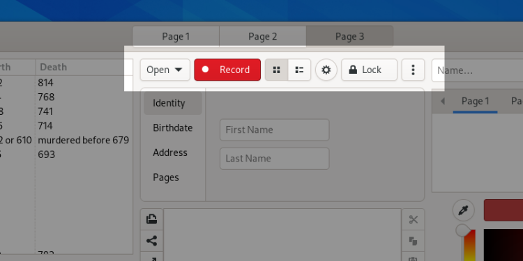

Buttons
=======

Buttons are one of the most common and basic user interface elements.

General Guidelines
------------------

* Typically, a button contains either an icon or a label. Buttons generally shouldn't contain both.
* Do not use more than one or two different widths of button in the same window, and ensure that buttons placed next to each other have the same width. This will give a better appearance.
* Do not assign actions to double-clicking or right-clicking a button. Users are unlikely to discover these actions, and if they do, it will distort their expectations of other buttons.
* Make invalid buttons insensitive, rather than showing an error message when the user clicks them.
* Button labels should use imperative verbs, using :ref:`header capitalization <header-capitalization>`. For example, *Save* or *Update*.
* Button labels should be short, in order to keep the button width low. Consider how labels will change length when localized.

.. _toggle-buttons:

Toggle Buttons
--------------

Toggle buttons switch between two states, set and unset. This state is indicated by the button being either “pushed in” or “popped out”, respectively.

Toggle buttons are an appropriate choice for modes or settings which have a obvious binary nature. They are generally used when space is limited, as an alternative to :doc:`switches </controls/switches>`.

Multiple toggle buttons can also be linked, to create a control for selecting one of a series of options. This approach is appropriate when the available options are not binary in nature and the options available can be expressed with short labels.

Linked toggle buttons are primarily used to fit an option into a relatively short space, such as a list row or header bar. When space isn't a limiting factor, other options such as :doc:`radio buttons </controls/radio-buttons>` might be a better choice.

A linked toggle button example can be found in the *Flap* demo in the LibAdwaita demo app.

.. _button-styles:

Button Styles
-------------

Buttons can be given a distinctive visual style, which can be appropriate in certain situations.ructive styles are available to highlight buttons in some situations.

* ``suggested-action`` can be used to highlight a button for affirmative action. This can be used to draw attention to the next step in a process.
* ``destructive-action`` can be used to draw attention to the potentially damaging consequences of using a button. This style acts as a warning to the user.

Each view should only ever include a single button using either the suggested or destructive styles.

Tooltips
--------

Tooltips can be set for any UI element, and have a variety of purposes, but the most common is to provide an explanatory label for buttons that have an icon rather than a label.

When to Use
~~~~~~~~~~~

Controls in header bars should all have tooltips. Elsewhere, try to keep tooltip usage to a minimum: only use them when they are really useful, either by providing information that users look for, or information that enhances the user experience.
 
Tooltips can get in the way when inadvertently displayed, so avoid providing them for every control or content item. Letting the pointer rest over an application window should typically not result in a tooltip being displayed.

Likewise, while some users will look for and make use of tooltips, they aren't available in all contexts (such as touch devices), and therefore shouldn't be relied upon to communicate essential information.

When setting tooltips, set them for all equivalent controls or elements in the app's UI. If a tooltip is provided for one control in a set, all other controls in that set should also have tooltips.

Tooltip Text
~~~~~~~~~~~~

* Should be written in :ref:`sentence capitalization <sentence-capitalization>`.
* For controls:
   * Should be a short description of what the control does or what it opens. 
   * Should be slightly longer and more descriptive than a button label, but should still be no longer than around 30 characters. For example: "Recently used documents", "Grid view". Still avoid unnecessary verbs such as "Open recently used documents" or "Switch to grid view". 
   * When the tooltip is for a control that already has a label, avoid repeating the label and try to provide useful supplementary information. For example, an "Open..." button could have a "Select a file" tooltip, or "Add User..." could have a "Create an account" tooltip.

Standard tooltip labels:

"Menu", "Search <content type>"

API Reference
-------------

* GtkButton: `GTK 4 <https://gnome.pages.gitlab.gnome.org/gtk/gtk4/class.Button.html>`_, `GTK 3 <https://developer.gnome.org/gtk3/stable/GtkButton.html>`_
* GtkToggleButton: `GTK 4 <https://gnome.pages.gitlab.gnome.org/gtk/gtk4/class.ToggleButton.html>`_, `GTK 3 <https://developer.gnome.org/gtk3/stable/GtkToggleButton.html>`_