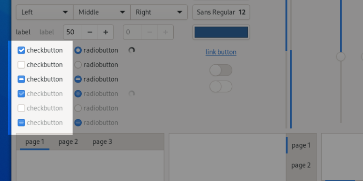

Checkboxes
==========

Checkboxes are used to show or change a setting.

Guidelines
----------

* Clicking a checkbox should not affect the values of other controls. It may sensitize, insensitize, hide or show other controls, however.
* If toggling a check box affects the sensitivity of other controls, place the checkbox immediately above the controls that it affects. This helps to indicate that the controls are dependent on the state of the check box.
* Use :ref:`sentence capitalization <sentence-capitalization>` for check box labels. For example: *Use custom font*.
* Label checkboxes to clearly indicate the effects of both their checked and unchecked states, for example, *Show icons in menus*. If the two states of a checkbox cannot be clearly communicated, consider using two radio buttons instead, so that both states can be given labels.
* Avoid negative checkbox labels, as this can be confusing and hard to understand. *Play alert sound* is better than *Disable alert sound*, for example.
* If a checkbox represents a setting for multiple items, and is set for some items in the selection and unset for others, show the checkbox in its mixed state. When a check box is in its mixed state:
   * Clicking the box once should check the box, applying that setting (when confirmed) to all the selected objects.
   * Clicking the box a second time should uncheck the box, removing that setting (when confirmed) to all the selected objects.
   * Clicking the box a third time should return the box to its mixed state, restoring each selected object’s original value for that setting (when confirmed).

API Reference
-------------

* GtkCheckButton: `GTK 4 <https://gnome.pages.gitlab.gnome.org/gtk/gtk4/class.CheckButton.html>`_, `GTK 3 <https://developer.gnome.org/gtk3/stable/GtkCheckButton.html>`_