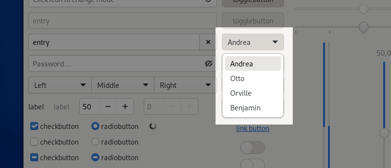

Drop-Down Lists
===============

Drop-down lists are used to select an item from a mutually exclusive set of options.

A drop-down list example can be found in the *Lists → Selections* demo in the GTK 4 demo application.

When to Use
-----------

Drop-down lists are typically appropriate when:

* the list of options is long
* the contents of the hidden part of the menu are obvious from its label and the one selected item. For example, if you have an option menu labelled "Month:" with the item "January" selected, the user might reasonably infer that the menu contains the 12 months of the year without having to look.
* there is little available space, such as in :doc:`header bars </containers/header-bars>`

If these factors don't apply, a :doc:`radio button <radio-buttons>` might be a better choice, since radio buttons present all the available options without the need to explicitly expose them.

Guidelines
----------

* Do not use drop-down lists with fewer than three items. To offer a choice of two options, use :doc:`radio <radio-buttons>` or :ref:`toggle buttons <toggle-buttons>`.
* Label drop-down lists using :ref:`sentence capitalization <sentence-capitalization>`. Provide an access key in the label that allows the user to focus the drop-down list.
* Use :ref:`sentence capitalization <sentence-capitalization>` for drop-down list items.
* Assign an access key to every drop-down list item. Ensure each access key is unique within the enclosing window or dialog, not just within the menu.

API Reference
-------------

* `GTK 4: GtkDropDown <https://gnome.pages.gitlab.gnome.org/gtk/gtk4/class.DropDown.html>`_
* `GTK 3: GtkComboBox <https://developer.gnome.org/gtk3/stable/GtkComboBox.html>`_
