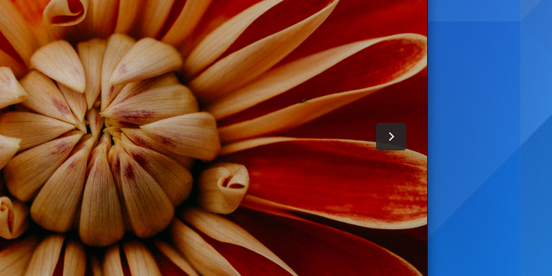

Overlaid Controls
=================

Controls are typically opaque and permanently visible. However, in some cases it is desirable to have semi-transparent controls which appear over window content.

When to use
-----------

Overlaid controls are appropriate for situations where it is desirable to show fewer controls while the user is not interacting with a window. The classic example is of a video player, which allows for a more immersive and uncluttered viewing experience.

Overlaid controls may be inappropriate if they obscure relevant parts of the content below. Image editing controls may interfere with the ability to see their effects, for example. In these cases, controls should not be overlaid.

Guidelines
----------

* Follow established conventions for this type of control, such as left/right browse buttons in image viewers, and player controls at the bottom window edge for video.
* Controls should be displayed when the pointer is moved over the content, or when it is tapped with a touch device.
* Overlaid controls can be attached to the edge of the content/window, or can be free-floating.

API Reference
-------------

* `GTK 4: GtkOverlay <https://gnome.pages.gitlab.gnome.org/gtk/gtk4/class.Overlay.html>`_
* `GTK 3: GtkOverlay <https://developer.gnome.org/gtk3/stable/GtkOverlay.html>`_
* Use the ``.osd`` style class for overlaid controls.
