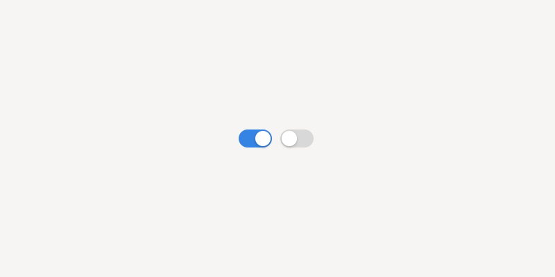

Switches
========

Switches can be used for controlling features, settings or hardware that has a clear on/off logic. They are particularly appropriate when they affect the operation of the application in a significant way.

:doc:`Check boxes <checkboxes>` have a similar functional role, and may be more appropriate in some situations. However, switches are generally preferred.

Guidelines
----------

* Label switches using nouns in :ref:`header capitalization <header-capitalization>`. For example, *Automatic Location* or *Notifications*. Give the label an access key to allow users to focus the switch using a keyboard.
* Only use a switch to control options that have a clear binary nature. If both states are not obvious, a :doc:`radio button <radio-buttons>` may be a better choice.

API Reference
-------------

* GtkSwitch: `GTK 4 <https://gnome.pages.gitlab.gnome.org/gtk/gtk4/class.Switch.html>`_, `GTK 3 <https://developer.gnome.org/gtk3/stable/GtkSwitch.html>`_
