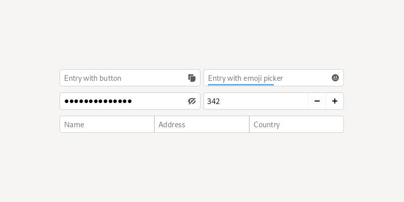

Text Fields
===========

Text fields are used for single line text entry and have a variety of uses, messaging, preferences and forms. :doc:`Search entries </nav/search>` are a type of text field which have their own dedicated pattern.

Multi-line text editing can be accomplished with a text view.

Guidelines
----------

* Give text fields a label using :ref:`header capitalization <header-capitalization>`, and assign an access key to the label, to allow people to focus the control using a keyboard.
* Size text fields according to the likely size of the content they will contain. This gives a useful visual cue to the amount of expect input.
* Take care to validate the content of text fields:
   * When using instant-apply, validate the contents of the entry field when it loses focus or when the window is closed, as opposed to after each keypress.
   * Alternatively, if the field accepts only a fixed number of characters, such as a hexadecimal color code, validate and apply the change as soon as that number of characters have been entered.
   * If the text field only accepts certain characters, such as digits, play the system warning beep when someone types an invalid character.
  
Embedding Icons, Buttons & Text
-------------------------------

Additional elements can be embedded in text fields. This can include:

* buttons, to provide actions which are internal to the text entry, such as a clear button, or a button that fills the field
* icons, to provide additional information relavant to the entry, such as a :doc:`progress spinner </feedback/spinners>` or status icon
* placeholder text, as an alternative to a label, in situations where there is little available space, or where a label would disrupt the overall visual layout

These conventions should generally be used with restraint and according to established conventions. Embedded icons should not be relied up to identify a text field, and should only be used when their meaning is commonly recognized without the need for additional explanation (such as through a tooltip).

Embedded icons should use the :doc:`symbolic style </guidelines/ui-icons>`.

Password Fields
---------------

Password fields are a special type of text field which hide any entered text. They include a  control for revealing hidden content, and indicate if *Caps Lock* is on.

Password fields can be used for entering any potentially sensitive text.

A password field example can be found in the *Entry → Password Entry* demo in the GTK 4 demo app.

Automatic Suggestions
---------------------

If possible, it is helpful to suggest potential text to be entered as the user types into a text field. For example, an address field can show previous locations as the user types. This reduces the amount of work for users and reduces errors.

An example of automatic suggestions can be found in the *Entry → Completion* example in the GTK 4 demo app.

Tags
----

Tags or tokens are a typical convention for some types of text field. For example, the *To* field in an email app will often display each recipient as a tag. This aids readability and makes it easy to remove each item from the field.

Currently, entry tags require a custom implementation. However, the GTK 4 demo application does include an example under *Entry → Tagged Entry*.

API Reference
-------------

* `GTK 4: GtkEntry <https://gnome.pages.gitlab.gnome.org/gtk/gtk4/class.Entry.html>`_
* `GTK 4: GtkTextView <https://gnome.pages.gitlab.gnome.org/gtk/gtk4/class.TextView.html>`_
* `GTK 4: GtkPasswordEntry <https://gnome.pages.gitlab.gnome.org/gtk/gtk4/class.PasswordEntry.html>`_
* `GTK 3: GtkEntry <https://developer.gnome.org/gtk3/stable/GtkEntry.html>`_
* `GTK 3: GtkTextView <https://developer.gnome.org/gtk3/stable/GtkTextView.html>`_
