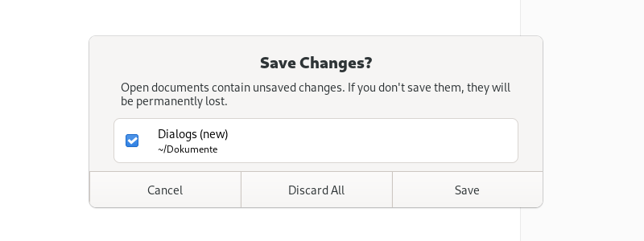

Dialogs
=======

Dialog windows present options, choices or information to users, which they must respond to in order to continue. There are two types of dialog in GNOME: message dialogs and action dialogs.

.. _message-dialogs:

Message Dialogs
---------------

Message dialogs present a message or question, along with between one and three buttons with which to respond. Message dialogs are an appropriate choice when it is essential that the user sees and responds to a message. However, they are also distruptive and alternatives should therefore always be considered.

Confirmation Dialogs
~~~~~~~~~~~~~~~~~~~~

Confirmation dialogs are a standard type of message dialog which check — or confirm — that the user wants to carry out an action before carrying it out. They have two buttons: one to confirm that the action should be carried out and one to cancel the action.

Destructive actions should always be accompanied by either a confirmation dialog or undo. Since users will often habitually click through confirmation dialogs them without fully reading or considering them, undo is typically a better option than a confirmation dialog. Undo also avoids interrupting the user, allows users to recover from errors, and gives them more time to change their mind.

However, in cases where it is not possible to offer an undo feature, a confirmation dialog is still recommended, to alert the user to the risk, to clarify which action will be taken, and to give them the opportunity to cancel.

Error Dialogs
~~~~~~~~~~~~~

Error dialogs are another standard type of message dialog which present an error message to the user. They often include a single button that allows the user to acknowledge and close the dialog.

.. _action-dialogs:

Action Dialogs
--------------

Action dialogs present options and/or information about an action, before it is carried out. *Print* and *Save* dialogs are classic examples of action dialogs.

Since action dialogs obscure the parent winodw and require a context switch on the part of a user, inline controls or actions are often preferable. In an email app, for example, email composition is generally better in the primary window, as opposed to an action dialog.

* Action dialogs have a header bar, a heading which describes the action, and two primary buttons — one which carries out the action and one which cancels it.
* Label the affirmative button with a specific imperative verb, for example: *Save* or *Print*. This is clearer than a generic label like *OK* or *Done*.
* Sometimes, the user may be required to choose options before an action can be carried out. In these cases, the affirmative dialog button should be insensitive until the required options have been selected.

General Guidelines
------------------

General guidelines for all types of dialogs:

* Never pop up a dialog window unexpectedly. They should only ever be displayed in immediate response to a deliberate user action.
* Dialogs should always have a parent window, to which they are modal.
* When opening a dialog, provide initial keyboard focus to the component that you expect users to operate first. This focus is especially important for users who must use a keyboard to navigate.

Guidelines on dialog buttons:

* Always ensure that the cancel button appears first, before the affirmative button. In left-to-right locales, this is on the left. This button order ensures that users become aware of, and are reminded of, the ability to cancel prior to encountering the affirmative button.
* Assign the return key to activate the affirmative button. However, this should not be done if its action is irreversible, destructive or otherwise inconvenient to the user. If there is no appropriate button to designate as the default button, do not set one.
* Ensure that the Esc key activates the cancel button, if there is one. Message dialogs with a single button can have both escape and return bound to the same button.

API Reference
-------------

* `GTK 4: GtkMessageDialog <https://gnome.pages.gitlab.gnome.org/gtk/gtk4/class.MessageDialog.html>`_
* `GTK 3: GtkMessageDialog <https://developer.gnome.org/gtk3/stable/GtkMessageDialog.html>`_
