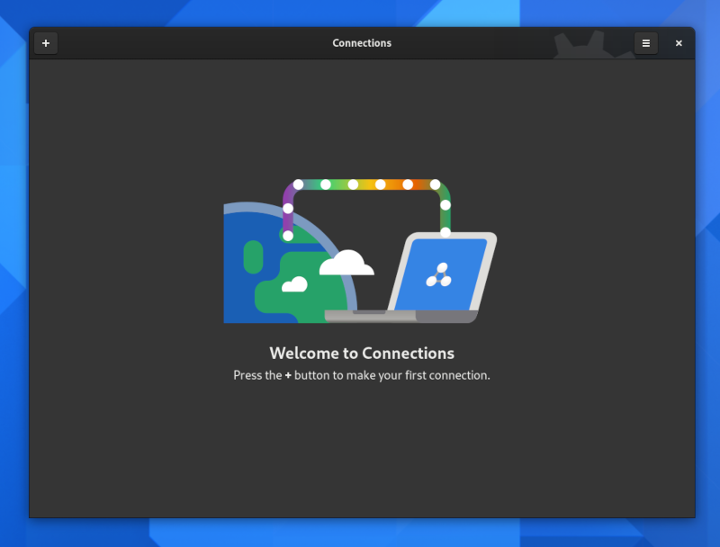
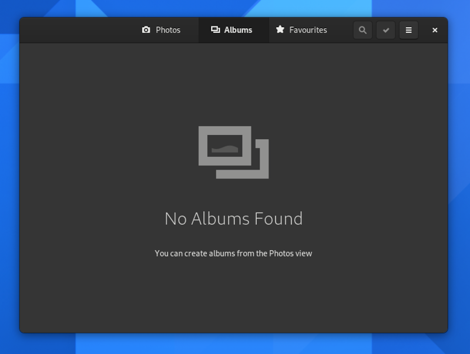

Placeholders
============

A placeholder is an image with accompanying text, which is used to fill a space that would usually be populated with content.

When to Use
-----------

One common use for placeholders is for the default state of an app, when it is first run and is yet to be populated with content. This can be a good way to guide the user into the experience, set a positive note, and establish a relationship with the user.

However, you should only use a placeholder for the initial view of your app when starting empty is unavoidable. In many cases it is often better to pre-populate the application instead of using a placeholder.

Empty placeholders should also be shown in other spaces that might often contain content, but which are empty, such as empty folders or albums.

Guidelines
----------

All placeholders should include a heading which communicates the empty state and provides guidance. For example, “Empty Folder”.

It is often helpful to include a description which provides additional guidance, such as how to add items. For example, “Use the **+** button to add items.”

It can also be a good idea to include controls for relevant actions, such as adding content or starting a setup assistant. This is one place where the :ref:`suggested button style <button-styles>` can be appropriate.

If the placeholder is used as part of the initial onboarding experience, the image should be rich and colorful, and the text should be positive and upbeat. This can also be an opportunity to strike up a relationship with the user by addressing them directly.

Alternatively, if the placeholder is used to fill a secondary view (such as an empty folder or album), the image and text should aim to be subtle and not attract undue attention. Therefore, use a symbolic icon in a muted color, and use a neutral tone for the text.

API Reference
-------------

* `Adwaita: AdwStatusPage <https://gnome.pages.gitlab.gnome.org/libadwaita/doc/main/AdwStatusPage.html>`_
* `Handy: HdyStatusPage <https://gnome.pages.gitlab.gnome.org/libhandy/doc/1-latest/HdyStatusPage.html>`_
