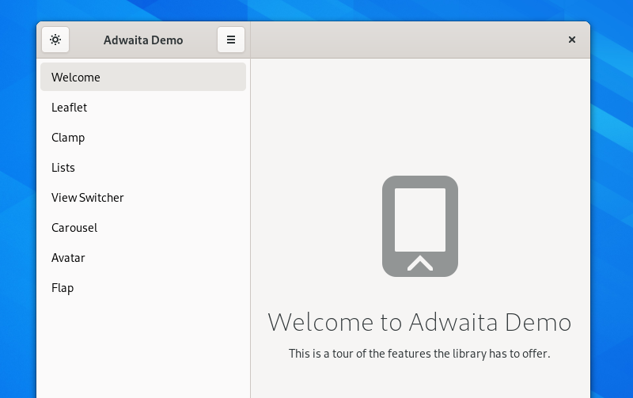

Placeholders
============

A placeholder is an image with accompanying text, which is used to fill a space that would usually be populated with content.

In GNOME there are two main types of placeholder: initial state placeholders, and empty placeholders.

Initial State Placeholders
--------------------------

Initial state placeholders are used when an application is first run. In addition to filling a blank space where content will eventually be shown, the initial state placeholder can also provide guidance and an encouraging start to the user experience.

Guidelines
~~~~~~~~~~

* Only use an initial state placeholder when the initial state being empty is unavoidable. In many cases it is often better to pre-populate the application.
* Initial state placeholders should be shown until the application is populated. If the application becomes empty subsequently, an empty state can be used.
* Imagery should be rich and colorful.
* The text that accompanies the image should be positive and upbeat. It can also be an opportunity to strike up a relationship with the user by addressing them directly.
* It can be a good idea to include controls in the initial state, to help people get started. This is one place where the :ref:`suggested button style <button-styles>` can be appropriate.

Empty Placeholders
~~~~~~~~~~~~~~~~~~

Empty placeholders are shown in spaces that might often contain content, but for some reason are empty. Examples include locations like folders or albums that are yet to be populated, or the main view of an app that has had its content removed.

Empty placeholders should not be displayed when an application is being run for the first time. In these situations an empty state is too negative and a richer, more characterful and positive experience is better.

Guidelines
~~~~~~~~~~

* For the image, use a symbolic icon that either represents your application, or the type of content that would ordinarily appear in the grid or list.
* An empty placeholder should always include a label which communicates the empty state. It is often appropriate to include a smaller subtext which provides additional guidance (such as how to add items). However, this should only be included if there is additional information that it is useful to provide.

API Reference
-------------

* `AdwStatusPage <https://gnome.pages.gitlab.gnome.org/libadwaita/doc/main/AdwStatusPage.html>`_
* `HdyStatusPage <https://gnome.pages.gitlab.gnome.org/libhandy/doc/1-latest/HdyStatusPage.html>`_
