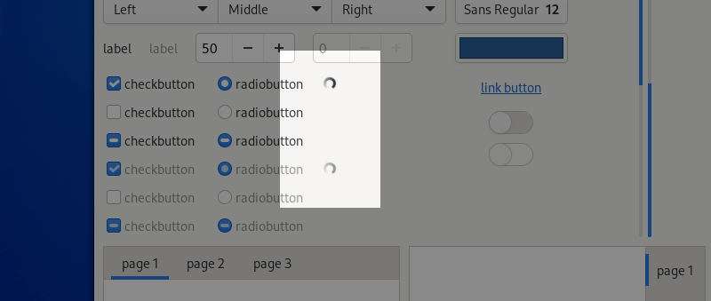

Spinners
========

Indicate progress.

When to use
-----------

Progress needs to be indicated whenever an operation takes more than around three seconds, both in order to indicate that the operation really is taking place and that an error hasn't occurred.

If an operation takes less that three seconds, it is better to avoid using a progress spinner, since animated elements that are shown for a very short amount of time can detract from the overall user experience.

Spinners do not display the proportion of the task that has been completed, or the time remaining. They are therefore better-suited to shorter operations. If the task is likely to take more than 30 seconds, a :doc:`progress bar </feedback/progress-bars>` might be a better choice.

General Guidelines
------------------

* If an operation can vary in how long it takes, use a timeout to only show a progress spinner after three seconds have elapsed.
* Place progress spinners close to or within the user interface elements they relate to.
* Generally, only one progress spinner should be displayed at once. Avoid showing numerous spinners simultaneously.
* A label can be shown next to a spinner, if it is helpful to clarify the task which a spinner relates to.
* If a spinner is displayed for a relatively long time, a label can indicate both the identity of the task and progress through it. This can take the form of a percentage, an indication of the time remaining, or progress through sub-components of the task (for example, items downloaded or pages exported).

API Reference
-------------

* `GTK 4: GtkSpinner <https://gnome.pages.gitlab.gnome.org/gtk/gtk4/class.Spinner.html>`_
* `GTK 3: GtkSpinner <https://developer.gnome.org/gtk3/stable/GtkSpinner.html>`_
