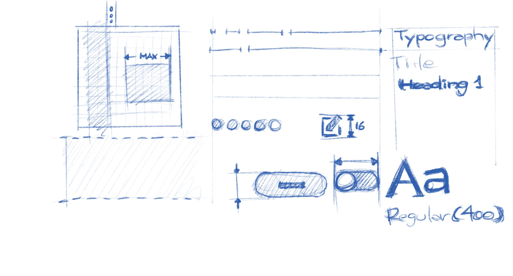

Guidelines
==========

General application design conventions and patterns for the GNOME platform.

Section Contents
----------------

.. toctree::
   :maxdepth: 2

   guidelines/app-naming
   guidelines/writing-style
   guidelines/typography
   guidelines/responsive
   guidelines/pointer-touch
   guidelines/keyboard
   guidelines/icons
   guidelines/icon-design
   guidelines/illustrations
