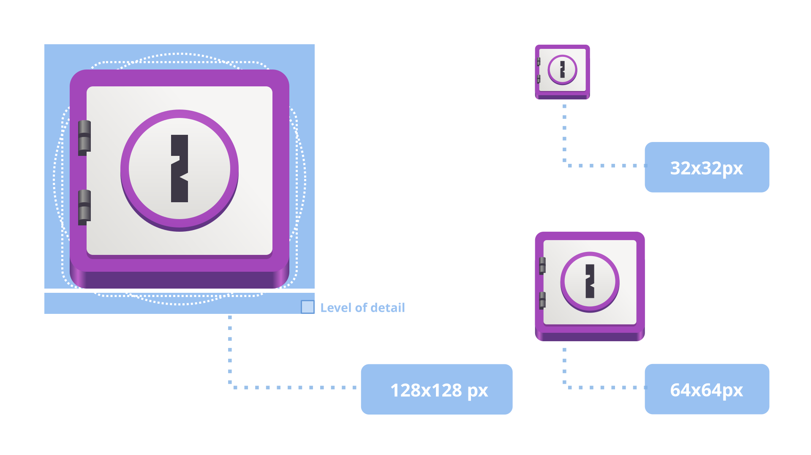
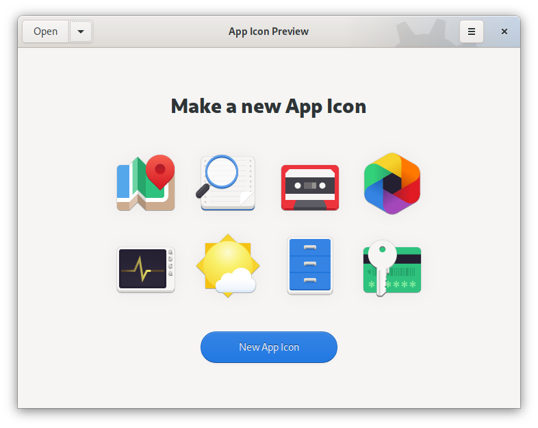
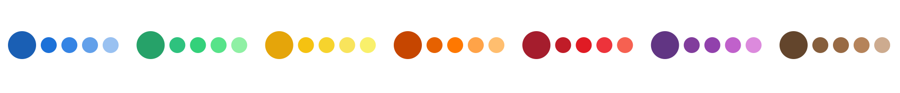
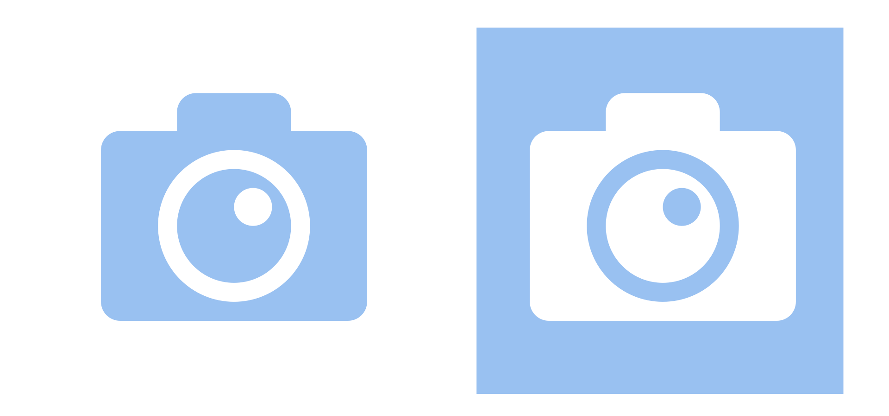

Icon Creation
=============

This page provides guidance on how to create icons, including both full-color icons and symbolic icons. For a more general overview of icon styles and usage, including the stock icons that are available, see :doc:`icons usage</guidelines/icons>`.

Full-Color Icons
----------------

The full-color icon style is most commonly used for application icons. The nominal size of full-color icons is ``128×128px``. However, because application icons are sometimes presented at lower resolutions, they should only feature detail that is presentable at ``64×64px`` resolution: anything more detailed would get lost by filtering/scaling down.

The `full-color icon template <https://gitlab.gnome.org/Community/Design/HIG-app-icons/blob/master/template.svg>`_ includes a 2px grid which should help you avoid adding detail that's finer than the desired threshold.

Perspective & Shape
-------------------

Full-color icons should be rendered with a simple orthogonal view and no real or isometric perspective. To provide depth a raised effect can be applied to mimic the Z-axis. Please keep the effect subtle though! Raising the object more than `2 detail units` (`4 nominal pixels`) is not recommended.

In order to aid recognition, each application icon should have a unique silhouette. However, to ensure visual balance with other application icons, the aspect ratio should not be extreme. Very narrow or very wide shapes should be avoided.

A `grid template <https://gitlab.gnome.org/Community/Design/HIG-app-icons/raw/master/template.svg>`_ is available to assist with placing your icon outline. Do not try to cover a maximum area of the canvas: the outside margin should be left empty. In some circumstances a small detail can be extended into this margin space.

Shadows
-------

Shadows can be drawn internally, within a full-color icon, with the light source pointing straight from above. However, shadows should not be drawn outside the main silhouette of the icon, as these are generated programmatically based on the context. When app icons are presented on a white background, for example, a strong drop shadow is rendered to help define the contours.

It is highly recommended to use the `App Icon Preview <https://flathub.org/apps/details/org.gnome.design.AppIconPreview>`_ app as it provides you with a complete workflow designing the app icon. From the up-to-date template to previewing the proper sizing and color in the context of other app icons, with properly generated drop shadow, up to generating optimized versions of the stable and development variants of the icon.

Palette
-------

Below is the baseline GNOME app icon color palette.

You are free to use different shades of these colors depending on the desired material effect. However, these primary colors are a good baseline to start from. A GIMP/Inkscape format palette `is available <https://gitlab.gnome.org/Teams/Design/HIG-app-icons/raw/master/GNOME%20HIG.gpl?inline=false>`_. Current versions of Inkscape and GIMP should ship with the GNOME HIG palette out of the box. You can make use of the `Color Palette <https://flathub.org/apps/details/org.gnome.design.Palette>`_ app to paste the GNOME colors into any 3rd party design app.

It is recommended to keep flat surfaces unshaded, but using gradients to signify bent surfaces is allowed.

Symbolic Icons
--------------

Symbolic icons have a simple form and are drawn within a ``16×16`` pixel grid. They are then programmatically scaled and colored within the user interface itself.

* Identify a single property when looking for an appropriate metaphor for an icon, and focus on what distinguishes the idea you want to communicate. For example, when describing an action to be performed on an image, it isn’t necessary to repeat the idea of an image in every icon. Instead, focus on what is distinct about each action (for example: rotate, tag, align).
* Avoid using any perspective in symbolic icons, stick to a simple orthogonal view.
* When using unfilled strokes for an outline, try avoiding hairline (``1px``) and do at least a ``2px`` stroke for the main feature of the icon.
* Symbolic icons are recolored at runtime to match the context, very much like a piece of text. While there are ways to “shade” parts of an icon by using opacity or creating duotone/pattern dithering, try avoiding these as much as possible.
* When a metaphor relies on the negative space, make sure it will work with the colors inverted. For example a camera lens spec/highlight will only work if lighter than the lens itself.

Size and grid
-------------

While symbolic icons are scalable and should work at any size, the basic canvas size is ``16×16`` grid units. You have the whole canvas to fill, but note that a filled rectangular object will appear stronger/larger when placed next to items that only use thinner strokes. Try to keep the contrast of your whole set.
