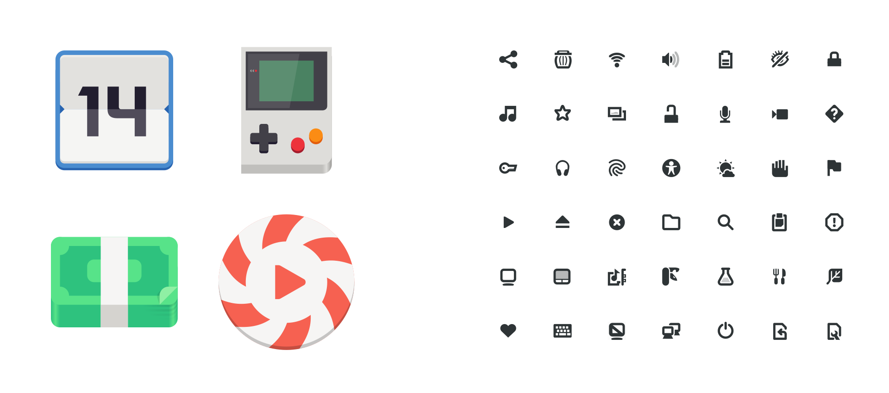

Icon Usage
==========

This page provides general guidance on which icons to use in an application, and how to use them. It also introduces resources for creating new icons.

.. _icon-styles:

Icon styles
-----------

Two styles of icon are used in GNOME: full-color and symbolic icons.

Symbolic icons
~~~~~~~~~~~~~~

Symbolic icons are simple and monochrome, and are designed to work well at smaller sizes. They are the primary icon style and the most common type of icon used in GNOME UI. For example, they are used for buttons.

Symbolic versions of icons have the ``-symbolic`` name ending, such as ``open-menu-symbolic``.

Full-color icons
~~~~~~~~~~~~~~~~
 
Full-color icons are colorful and are optimized for larger sizes.

Application icons are the most prominent type of full-color icons. (Applications are also recommended to provide a symbolic version of their icon, which is used for the high-contrast accessibility feature, as well as in contexts where a legible low-resolution icon is required.)

Full-color icons can also be used in cases where icons are displayed at large sizes and are intended to be the focus of attention. File and folder icons in a file manager are a good example of this.

Icon sizing
-----------

To ensure sharp rendering, icons should only be used at the following sizes:

.. list-table::
  :widths: 20 20 60
  :header-rows: 1

  * - Style
    - Defined size
    - Usage sizes
  * - Symbolic
    - 16×16px
    - 16×16px, 32×32px, 64×64px
  * - Full-color
    - 128×128px
    - 32×32px, 64×64px, 128×128px, 256×256px, 512×512px

Using stock icons and creating your own
---------------------------------------

Generally speaking, it is better to reuse existing GNOME applications, as opposed to creating your own. GNOME provides a set of standard icons, which should be consistently used by applications.

Application icons are the exception to this rule. Applications should have their own unique icon, and should never reuse an existing one. The :doc:`icon design guidelines <icon-design>` provide more details on how to create your own icons, including application icons.

General guidelines
------------------

Only use icons which will be recognized by your users. This includes:

* Icons whose meaning is commonly recognized. This set of icons is actually quite small, and is dictated by convention. It includes standard icons such as search, menu, forward, back and share. If you are in doubt, only use icons which are frequently used in other applications.
* Icons will be meaningful in the specific context of your application — users of specialist tools will often be familiar with domain-specific symbols.

If users will not recognize an icon, it might be better to use a text label instead.

Some icons are only meaningful alongside other icons of the same type. For example, a media icon for stop is simply a square, and may not be identified as a stop icon without other media controls (like play, pause, or skip) being visible close by. Likewise, the icon to remove an item from a list is a subtract symbol (i.e. a single line), and will not be recognizable without a corresponding “plus” add icon.
