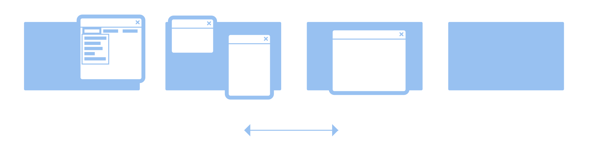

Illustrations
=============

FIXME: When to use Illustrations

* Empty states
* Error states
* Onboarding/introductions

Full color
----------
Scalable style built around geometric shapes and a somewhat loose grid layout.

* **Background color**. Derived from the basic colors defined for :doc:`app icons </guidelines/icon-design>`
* **Library/Clipart**. Get some inspiration and kit-bash from `existing assets <https://gitlab.gnome.org/Teams/Design/app-illustrations/-/blob/master/clipart/clipart.svg>`_.

Blueprint
---------

Suitable for documentation. Don't attract too much attention. Explain with graphs and diagrams.

* **UI Elements**. Demonstrate UI elements without the high fidelity, avoiding quickly getting out of date.
* **Isometric**. The use of isometric perspective allowed to form more complex structures.

