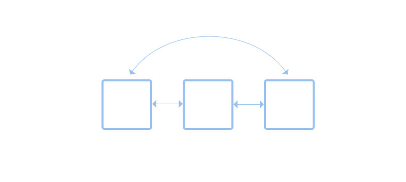
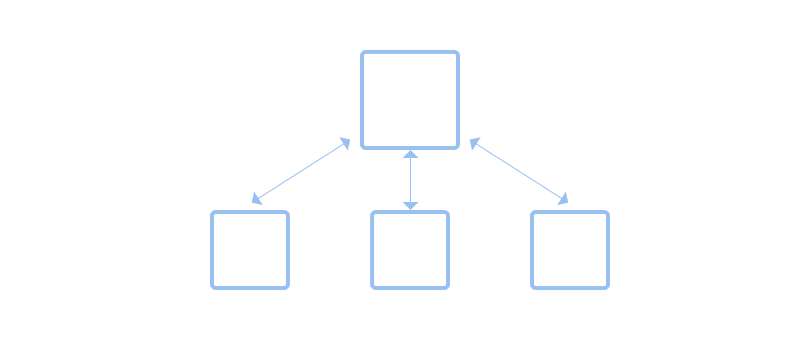
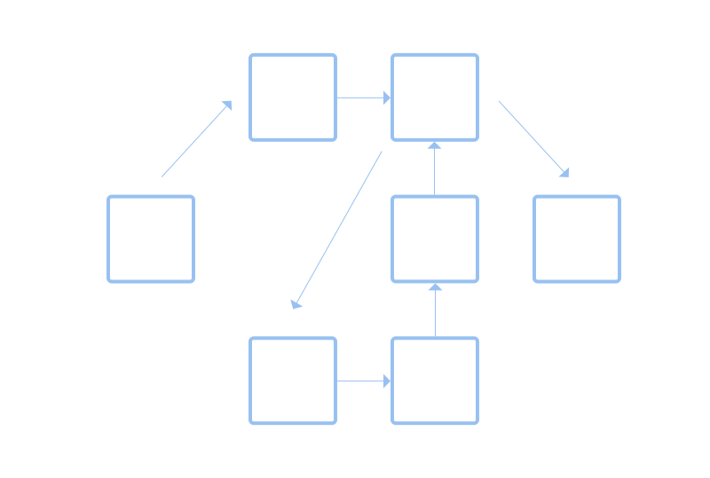
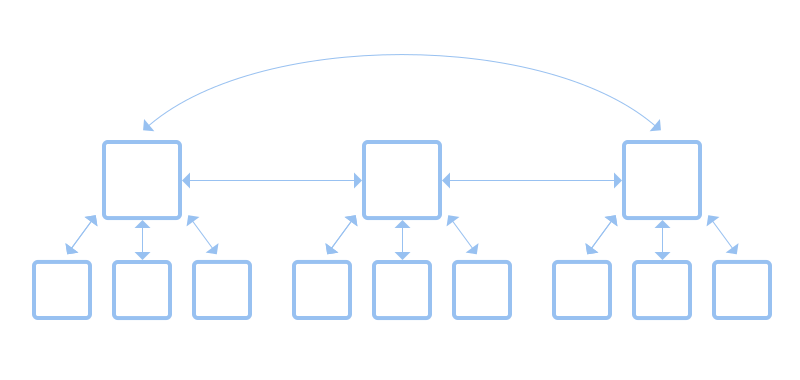
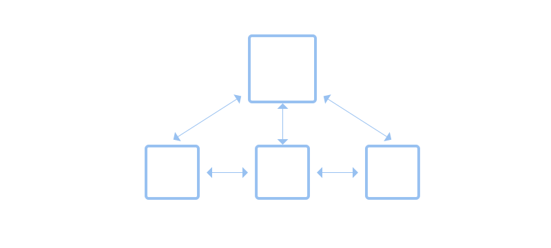

Navigation
==========

Navigation refers to movement through different views. It is an essential technique for allowing collections of content to be viewed. Navigation can also be an effective way to organize large numbers of UI controls, such as preferences.

There are a number of standard design patterns for implementing navigation, which are covered in the :doc:`navigation section </nav>`. This page covers general design considerations which are relevant to all forms of navigation.

.. _navigation-types:

Navigation Types
----------------

There are various types of navigation structure. The following are three of the main types.

Lateral
~~~~~~~

Lateral navigation allows movement between a set of views. It is possible to move from one view to another, in any order. Lateral navigation is appropriate for arranging views or content which is similar in type, scale and importance.

:doc:`View switchers </nav/view-switchers>` and :doc:`sidebars </nav/sidebars>` and :doc:`tabs </nav/tabs>` are the main design patterns for this type of navigation.

Hierarchical
~~~~~~~~~~~~

Hierarchical navigation allows movement between an overview page which shows multiple items, and dedicated views for each of those items. Movement is typically only vertical: navigation between individual sub-views is not possible.

Hierarchical navigation is appropriate when it is desireable to have both an "overview" and dedicated views of each item. Hierarchical navigation typically uses :doc:`browsing </nav/browsing>`.

Path-Based
~~~~~~~~~~

Path-based navigation is typically used when an app allows free navigation through an external data structure, as in the cases of web and file browsers. This type of navigation is typically sequential in nature, with back and forward actions reflecting the steps taken by the user, as opposed to the underlying navigation structure.

Combining Navigation Types
--------------------------

The types of navigation structure described above can be used on their own, and this is appropriate for relatively simple structures. However, for more complex cases with content of varying types, it is often necessary to combine them into more elaborate arrangements.

One of the most common navigation combinations arranges multiple content overviews laterally. This makes it possible to browse multiple sets of content items. The top-level lateral arrangement provides a clear and easy to understand structure.

While it isn't typically expected of hierarchical navigation, in some cases movement between sub-views can be appropriate. This is particularly the case when there is a pre-existing order to the sub-views.

A photo viewer is a good example of this principle. Since photos have a time order, it makes sense to allow browsing between each individual photo in that sequence.

Guidelines
----------

* Ensure that the amount of content in each view is easy to digest: don't pack too much in.
* Each view should have a clear focus or subject.
* Don't overcomplicate navigation by combining multiple navigation types in non-standard ways. Keep it simple.
* Avoid deeply nested hierarchies. As a rule, hierarchies should generally only have one level of depth.
* Support the :ref:`standard keyboard shortcuts for navigation <navigation-shortcuts>`.
