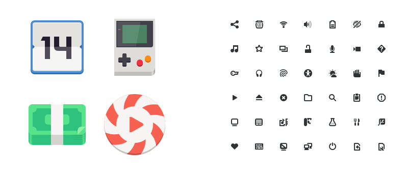
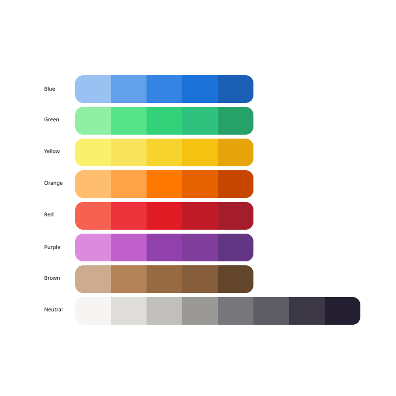

# Visuals

## Icons and artwork

Icons are a basic element in user interfaces. They also make up a fundamental part of application identities. This page provides an overview of icon usage. It also describes which icons are available through the GNOME platform, introduces resources for creating new icons, and includes some general guidelines on using icons in user interfaces.

### Icon styles

Two styles of icon are used in GNOME: full-color and symbolic icons.

Full-color icons are colorful and detailed, and are optimized for larger sizes. They are defined as `128×128px` SVGs, and are sharpest when scaled up in multiples of `128` (such as `256✕256` and `512✕512`).The design of full-color icons also allows them to be rendered sharp at `64×64px` and `32×32px`, but is not advised to make them any smaller.

Symbolic icons are simple and monochrome, and are designed to work well at smaller sizes. They are defined as `16✕16px` SVGs, and can be scaled to multiples of `16` (such as `32✕32` and `64✕64`). Symbolic icons generally have a neutral color, although their color can be changed programmatically.

### Icon uses

Application icons are the most prominent type of icons. Every application should have its own unique and beautiful application icon: it is the face of the application, and the first visual element a user sees when browsing for new applications.

Application icons use the full-color style. Applications are also recommended to provide a symbolic version of their icon, which is used for the high-contrast accessibility feature, as well as in contexts where a legible low-resolution icon is required.

User interface icons typically use the symbolic style and this is the primary icon style used for user interface controls. The most common and obvious example of symbolic icon usage is on buttons.

Apart from application icons, the full-color icon style can also be used in cases where icons are displayed at large sizes and are intended to be the focus of attention. File and folder icons in a file manager are a good example of this.

### Stock icons and creating your own

GTK provides a set of standard icons, which can be used by applications. Symbolic versions of icons have the `-symbolic` name ending, such as `open-menu-symbolic`.

[Icon design guidelines](icon-design) provide more details on how to create your own icons, including application icons.

### Using icons in your user interface

Icons are a common user interface element and they have some practical advantages over text labels (such as being smaller). At the same time, over-use of icons can lead to confusion and a poor user experience. Likewise, the use of inappropriate icons can often make an interface difficult to use.

Therefore, only use icons whose meaning is commonly recognized. If a commonly recognized icon is not available, it might be better to use a text label instead. Typically, convention establishes which icons are commonly recognized. This set of icons is actually quite small, and includes standard icons such as search, menu, forward, back and share. If you are in doubt, only use icons which are frequently used in other applications.

### Other things to consider when using icons:

* **Think about which icons will be meaningful in the specific context of your application** — users of specialist tools will often be familiar with domain-specific symbols.
* **Remember that some icons are only meaningful alongside other icons of the same type**. For example, a media icon for stop is simply a square, and may not be identified as a stop icon without other media controls (like play, pause, or skip) being visible close by. Likewise, the icon to remove an item from a list is a subtract symbol (i.e. a single line), and will not be recognizable without a corresponding “plus” add icon.

## Illustrations

FIXME

## Color palette

FIXME

