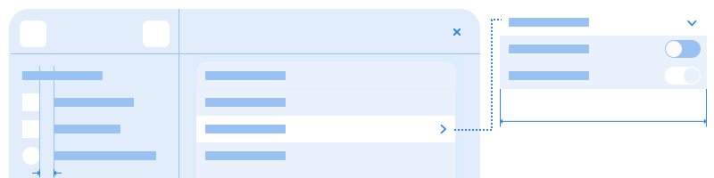

Navigation
==========

Combined with :doc:`containers <containers>`, the navigation design patterns create the basic structure for an app. Simple apps will often use just one or two navigation patterns, but more complex designs can use more. This will typically involve nesting navigation structures inside one another. For example, views inside a view switcher could also include stacks.

Contents
--------

.. toctree::
   :maxdepth: 1

   nav/stacks
   nav/view-switchers
   nav/tabs
   nav/sidebars
   nav/search
