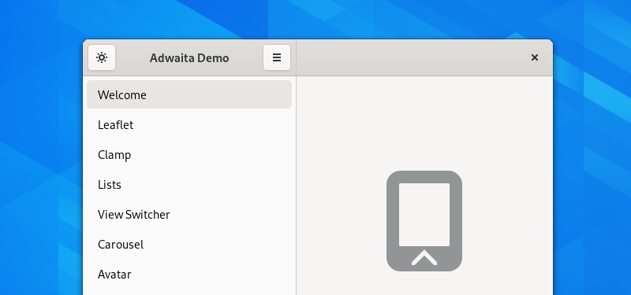

Sidebars
========

A sidebar allows switching between different views. Visually they are similar to :doc:`utility panes </containers/utility-panes>`, but they play a different role and behavior.

When to Use
-----------

Sidebars can be used when it is necessary to expose a larger number of views than can be accommodated in a standard :doc:`view switcher </nav/view-switchers>`.

Sidebars can also be appropriate when it is necessary to navigate between dynamic locations, such as a messaging app. They are also suited to contexts where frequent switching back and forth between locations is common.

Sidebars should be avoided for apps which provide rich or immersive content. In this situation, the sidebar would be a distraction from application content.

Guidelines
----------

* Order the list according to what is most useful for the users of your application. It is often best to place recently updated items at the top of the list.
* Header bar controls which affect the sidebar list should be placed above the list.
* Each list row can include multiple lines of text, as well as images. However, be careful to ensure that the most important information is not lost, and work to ensure a clean and attractive appearance.
* To support :doc:`responsive scaling </guidelines/responsive>`, sidebars should collapse to a stack when the window becomes narrow. This can be accomplished with a leaflet.

API Reference
-------------

* `GTK 4: GtkStackSidebar <https://gnome.pages.gitlab.gnome.org/gtk/gtk4/class.StackSidebar.html>`_
* `Adwaita: AdwLeaflet <https://gnome.pages.gitlab.gnome.org/libadwaita/doc/main/AdwLeaflet.html>`_
* `GTK 3: GtkStackSidebar <https://developer.gnome.org/gtk3/stable/GtkStackSidebar.html>`_
* `Handy: HdyLeaflet <https://gnome.pages.gitlab.gnome.org/libhandy/doc/1-latest/HdyLeaflet.html>`_
