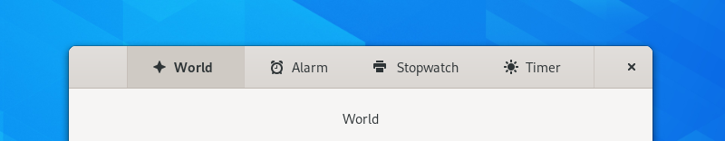

View Switchers
==============

A view switcher is a control that allows switching between a small number of predefined views. For example, a music application could show different views for artists, albums and playlists.

Guidelines
----------

* As a rule of thumb, a view switcher should contain between three and five views. If you have more views, a :doc:`sidebar <sidebars>` might be a more appropriate choice.
* Label views with :ref:`header capitalization <header-capitalization>`, and use nouns rather than verbs, for example *Albums* or *Updates*. Try to give view labels a similar length.
* When used for preferences, do not design views whose controls affect the controls in other views. Users are unlikely to discover such dependencies.
* Buttons in the view switcher widget can indicate when there is activity in a view. For example, this could indicate if there is new content available.
* View switchers should switch to the bottom window edge if the window becomes too narrow for them to fit in the header bar.

API Reference
-------------

* `Adwaita: AdwViewSwitcherBar <https://gnome.pages.gitlab.gnome.org/libadwaita/doc/main/AdwViewSwitcherBar.html>`_
* `Handy: HdyViewSwitcherBar <https://gnome.pages.gitlab.gnome.org/libhandy/doc/1-latest/HdyViewSwitcherBar.html>`_
