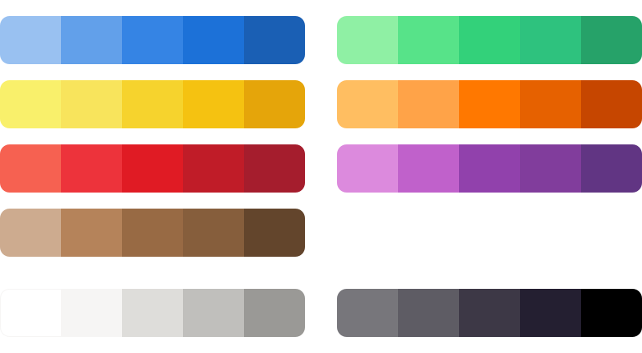

Palette
=======

The GNOME color palette is intended for use in app icons and illustrations.

The palette can be accessed using the `Palette app <https://flathub.org/apps/details/org.gnome.design.Palette>`_, through the predefined palettes in recent versions of the GIMP and Inkscape, or by `downloading it in GIMP/Inkscape format <https://gitlab.gnome.org/Teams/Design/HIG-app-icons/raw/master/GNOME%20HIG.gpl?inline=false>`_.